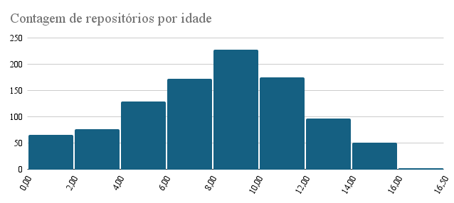
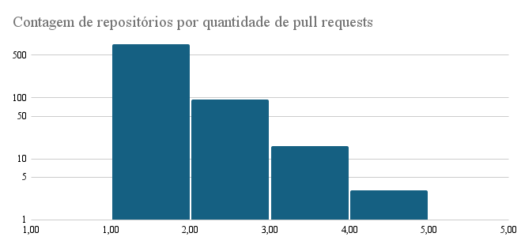
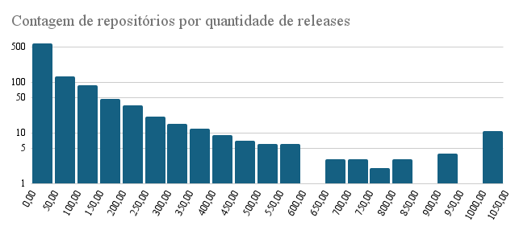
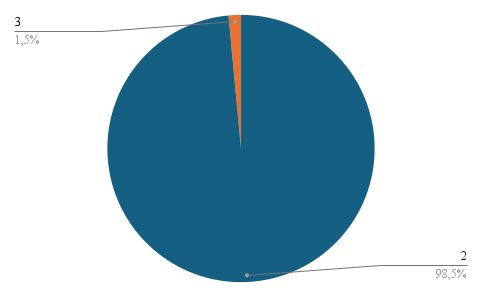
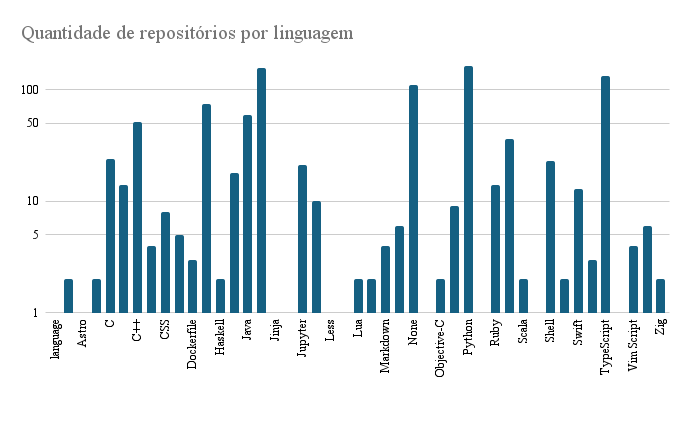
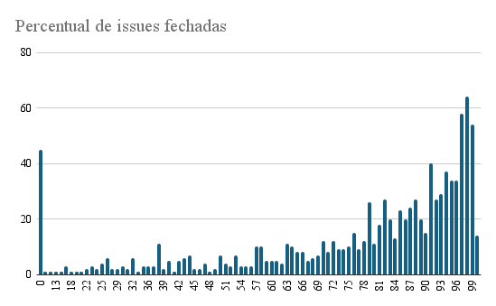

# Relatório Final

---

## Introdução

Este relatório examina características dos 1.000 repositórios mais populares no GitHub, com o objetivo de entender padrões relacionados à idade dos repositórios, contribuição externa, frequência de releases e resolução de issues. Analisamos dados para responder às seguintes questões de pesquisa (RQs):

**Hipóteses informais**:

- **Hipótese 1:** Sistemas populares tendem a ser mais maduros e antigos.
- **Hipótese 2:** Sistemas populares recebem uma alta quantidade de contribuições externas, refletida em um número elevado de pull requests aceitas.
- **Hipótese 3:** Sistemas populares têm um ciclo de lançamentos frequente, evidenciado por um grande número de releases.
- **Hipótese 4:** Sistemas populares são atualizados frequentemente, com pequenas lacunas entre as atualizações.
- **Hipótese 5:** Sistemas populares são escritos nas linguagens de programação mais utilizadas, como Python, JavaScript e TypeScript.
- **Hipótese 6:** Sistemas populares possuem um alto percentual de issues fechadas, indicando um bom nível de manutenção.

---

## Metodologia

Para responder às questões de pesquisa, utilizamos a seguinte abordagem:

1. **Coleta de Dados**: Extraímos informações de 1.000 repositórios com o maior número de estrelas no GitHub, no dia 29/08/2024, incluindo data de criação, número de contribuições externas, frequência de releases e tempo de resolução de issues.
2. **Cálculo das Métricas:** Foram calculadas as medianas para idade dos repositórios, total de pull requests aceitas, total de releases, tempo até a última atualização e percentual de issues fechadas. Para a análise da linguagem de programação, foi realizada uma contagem das linguagens mais utilizadas.

---

#### 3. Resultados
A seguir, apresento os resultados medianos para cada uma das questões de pesquisa:

1. **Idade do repositório (anos):** 8 anos
2. **Total de pull requests aceitas:** 972 pull requests
3. **Total de releases:** 30 releases
4. **Tempo até a última atualização (dias):** 2 dias
5. **Linguagens de programação mais comuns:** 
   - Python: 164 repositórios
   - JavaScript: 157 repositórios
   - TypeScript: 132 repositórios
6. **Percentual de issues fechadas:** 86.99%

#### 4. Discussão das Hipóteses
Com base nos resultados obtidos, as seguintes observações podem ser feitas:

- **Hipótese 1:** Confirmada. A mediana de 8 anos para a idade dos repositórios sugere que os sistemas populares tendem a ser maduros e estabelecidos.
  - Em sua maioria, os repositórios mais famosos tem entre 8 a 10 anos.

  
- **Hipótese 2:** Confirmada. Uma mediana de 972 pull requests aceitas indica que sistemas populares atraem uma quantidade significativa de contribuições externas.

  
- **Hipótese 3:** Parcialmente Confirmada. A mediana de 30 releases indica uma frequência de lançamentos razoável, embora isso possa variar dependendo do tipo de projeto.
  - Podemos observar o gráfico a tendência de dias da última atualização e hoje, que em sua grande maioria são 2 dias
  

  
- **Hipótese 4:** Confirmada. A mediana de 1 dia para o tempo até a última atualização reflete uma alta frequência de manutenção.
 - Podemos observar no gráfico a quantidade de dias que se passaram entre a última atualização e a data de análise dos resultados (01/09/2024), que em sua grande maioria são de 2 dias.

  
- **Hipótese 5:** Confirmada. As linguagens mais populares são Python, JavaScript e TypeScript, o que está de acordo com as expectativas.

  
- **Hipótese 6:** Confirmada. Com uma mediana de 86.99% de issues fechadas, fica evidente que sistemas populares mantêm um bom controle sobre as issues.

#### 6. Conclusão
A análise confirma a maioria das hipóteses iniciais, revelando que os sistemas populares no GitHub são maduros, frequentemente atualizados, bem mantidos, e escritos nas linguagens mais populares. Além disso, a análise comparativa sugere que sistemas em linguagens populares como Python, JavaScript e TypeScript tendem a receber mais contribuições externas, lançar mais releases e ser atualizados com mais frequência do que sistemas em outras linguagens.
